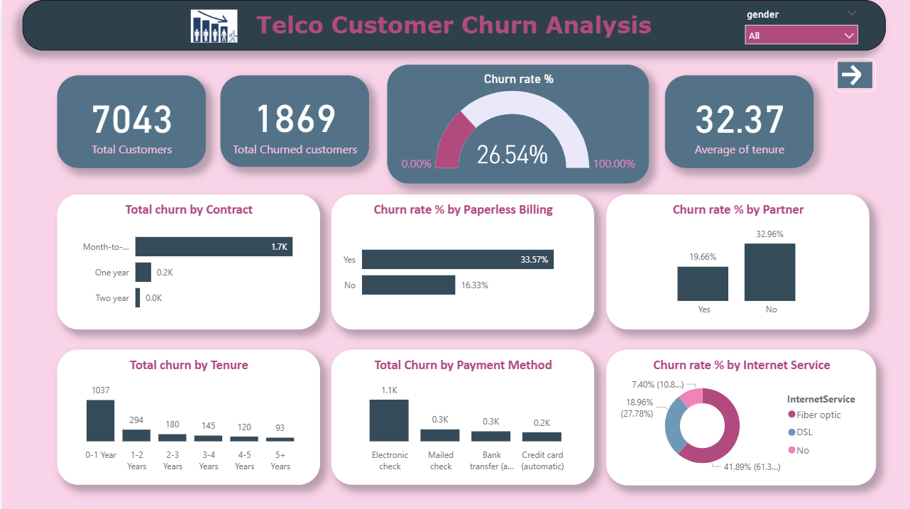
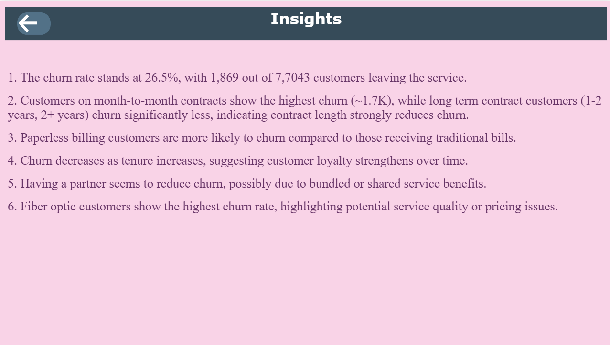

# **Customer Churn Analysis Dashboard**

## This project uses Power BI Desktop and Excel to help businesses prevent customer loss and improve customer service.

## **Key Features**
📌 Predictive churn modeling: Identify at risk customers before they churn, enabling proactive interventions and retention stratergies.

## **Built with:**
1. Power BI Desktop
2. Microsoft Excel

## **Key Insights**

**Insights**
1. The churn rate stands at 26.5%, with 1,869 out of 7,7043 customers leaving the service.**

2. Customers on month-to-month contracts show the highest churn (~1.7K), while long term contract customers (1-2 years, 2+ years) churn significantly less, indicating contract length strongly reduces churn.

3. Paperless billing customers are more likely to churn compared to those receiving traditional bills.

4. Churn decreases as tenure increases, suggesting customer loyalty strengthens over time.

5. Having a partner seems to reduce churn, possibly due to bundled or shared service benefits.

6. Fiber optic customers show the highest churn rate, highlighting potential service quality or pricing issues.

## **Benefits:**
1. Reduce customer loss: Identify and help customers at risk to keep them longer.
2. Improve customer satisfaction: Understand customer needs better for better service.
3. Make data-driven decisions: Use insights to make better choices for keeping customers happy.
